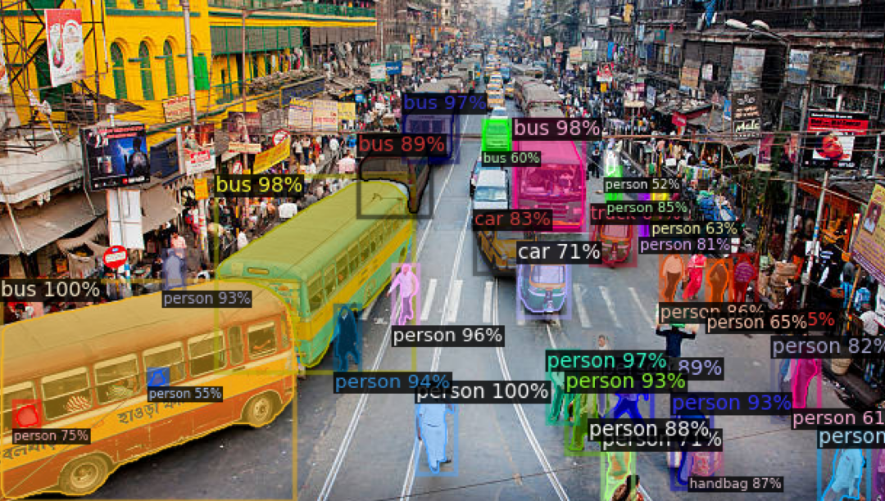

# **Detectron2** Instance Image Segmentation 
Detectron2 is Facebook AI Research's next generation library that provides state-of-the-art *detection and segmentation algorithms.*

## [Implementation]("pretrained-detectron2.ipynb") **Detectron2** pre-trained model 


I have used the pre trained s**detectron2** models from **Model-Zoo** and perfromed the Instance Image Segmentation. Used ```COCO-InstanceSegmentation/mask_rcnn_R_101_FPN_3x.yaml``` pre-train model. 

